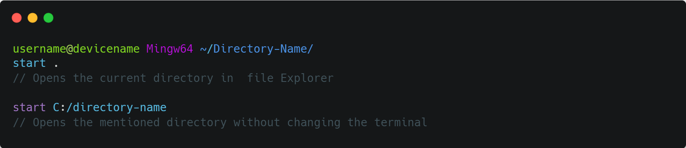
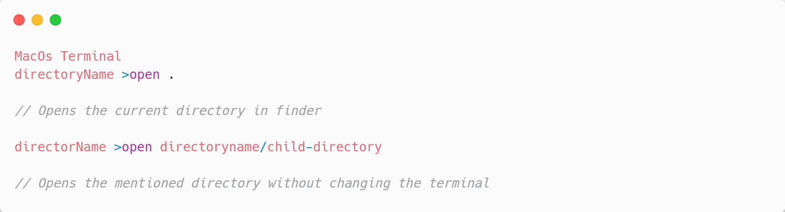

# BasicTerminalCommands
Learn some basic Linux terminal commands
 
 
<h2>'Ls' Command</h2>
<code>"ls" Command is used to list the content or items present in the current directory</code>
 
 

 
 
<code>"ls -a" is used to display the hidden files available in the directory</code>
 
 

 
 
 
<h2>'pwd'(Print working directory) Command</h2>
<code>'pwd' command is used to print the path of the current directory were you are in.</code>
 
 

 
 
<h2>'cd' (Change Directory) Command </h2>
<code>'cd' command is used to change the directory of working terminal</code>
 
 

 
 
 
<code>'cd ..' is used to go back to the parent directory of a current working directory in the windows explorer</code>
 
 
 
 

 
 
 
<code>'cd ../..' command is used to go two directories back from the current directory</code>
 
 

 
 
 
<h2>'start' command Works only with windows</h2>
<code>'start' command is used to open current directory in </code>
 
 

 
 
 
<h2>'open' command (not works with windows)</h2>
 
 
<code>'open; command is used to open current working directory in the finder or explorer only works in MacOs and linux</code>
 
 

 
 
 
<h2>'touch' Command is used to create new files</h2>
<code>'touch' coommand is used to create a new file in current directory</code>
 
 

 
 
 
<h2>'mkdir' (Make Directory) Command</h2>
<code>'mkdir' command is used to make or create new directory</code>
 
 

 
 
 
<h2>'rm' Command</h2>
<code>'rm' command is used to remove or delete the file from the current directory</code>
 
 

 
 
 
<h2>'rm -rf' Command</h2>
<code>'rm -rf' command is used to remove or delete the folder from the current directory</code>
 
 

 
 
